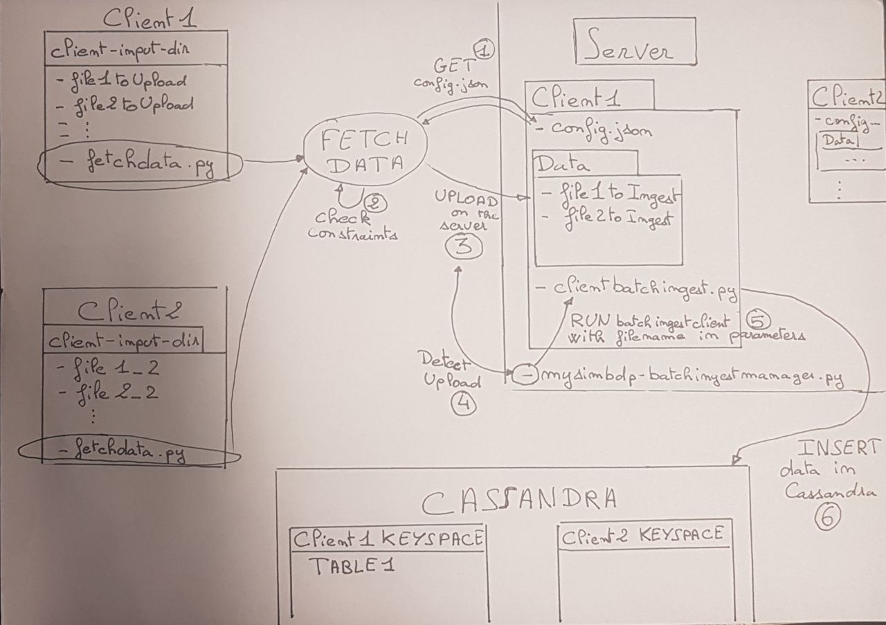

# Part 1 : Batch Ingestion

This part has following components:

* mysimbdp-fetchdata
* Batchingest_manager
* Client_batchingestapp

The batch ingestion copies the files into Mysimbdp and enters the data from the files into the database.

## Architecture

The architecture of this part is composed of 3 pieces:
* A part specific to each user (local), which we will basically call Local for the rest of the report
* A first server on which the client files will be sent, which we will basically call Server for the rest of the report
* A second server, a Cassandra server, which is the database in which the data will be stored, which we will basically call Cassandra for the rest of the report



## FetchData

The role of this component is to move the data from the client-input-directory to staging destination.
I have chosen to consider that the client-input-directory is local on the client's machine.
The fetchdata script is given to each customer to be executed as soon as the customer wants it.
It is therefore generic and is the same for all customers.

When the customer wants to run it, he have to provide his username, his password and optionaly the name of the directory from which he wants to send the files (by default it is ```client-input-dir```) :
```python3 ./fetchdata.py -u <USERNAME> -p <PASSWORD> [-d <DIRECTORYNAME>]```

From there, the script sends a GET request to the Server to recover the informations of the client's file configuration constraints.
For every files in the client-input-directory the fetchdata component proceeds to check the client's configuration constraints.
As soon as a file validates the constraints it is sent to the server.

### Constraints into configuration file

I choose to use a JSON file in order to group the configuration constraints.
* Formats lists all file formats allowed for upload.
* Number_files is the total number of files allowed per upload. I was first thinking of making it the maximum number of files on the server for a given client. But my dataingestmanager script allows us to send in database the data of a file as soon as the file is uploaded on the Server.
* Data_sizes is for the maximum size for a file.

An example code of a configuration constraints file is :

```json
{
    "formats":[".csv"],
    "number_files":10,
    "data_sizes":4096
}
```

### Users authentification

For client authentication, I just have a json file on my Server that is checked each time a GET request is sent.
The password is encrypted on the Server.
For the moment I have configured my Server for 2 clients:
```customer-1 password-1```
```customer-2 password-2```

My users.json file is:
```json
{
    "customer-1":"97d0eed887efa9702fcba83a64ace149ea7923227a8649cbb01dc825f09118c8e0f95c5a4a496dd30d35554ef3984c697d3f7541d517e6c6c642189a23b21accfb8b5e7aa6b4b12f6e824ddca05818ff82c4df4799e083ff1a4d7957743070f8",
    "customer-2":"aa9e53cc66ff8252bb6d29a5829bc83802f320169c25170660537c55aedb8047ae0197077815317a1cb0af21149173f4293575332da4e3d12680d9c3e3f1d2a9f88cee90cda580be1221ba73ca18a2ab7d4f4558d08532c4b5cbff21a7471797"
}
```

## Batch Ingest Manager & ClientBatchingestapp

The batch ingest manager is responsible for calling/running the client's script whenever a file of that customer is upload into the Server.
To do this, I used the watchdog library of python which allows to create Observer that I activate as soon as a file to be inserted is uploaded on the Server.
Depending on the directory in which the file is uploaded (so depending on the client that has uploaded the file) it calls the corresponding dataingestclient script that was given by the client when creating his account (which was not processed in the implementation of this assignment but which is one of the first things I would like to implement in addition on this Server).

Each dataingestclient connects to Cassandra and uses the customer's own Keyspace.
Dataingestmanager allows us to collect logs on the speed of execution of the request as well as other information (size of the file, number of lines, the client concerned...).

Logs follow this structure :
```log

2019-10-31 15:16:22 - Ingestion of the file: Data1000lines.csv for customer-1 - size: 128.7978515625 KB - 999 lines ingested in 0.8234226703643799 seconds
2019-10-31 15:16:23 - Ingestion of the file: Data1000lines2.csv for customer-1 - size: 124.744140625 KB - 1000 lines ingested in 1.0246901512145996 seconds
2019-10-31 15:16:24 - Ingestion of the file: Data1000linesae.csv for customer-1 - size: 118.5966796875 KB - 1000 lines ingested in 0.8117904663085938 seconds
2019-10-31 15:16:25 - Ingestion of the file: Data1000linesai.csv for customer-1 - size: 111.1611328125 KB - 1000 lines ingested in 0.7847237586975098 seconds
2019-10-31 15:18:00 - Ingestion of the file: Data1000linesaf.csv for customer-2 - size: 112.677734375 KB - 1000 lines ingested in 1.019026517868042 seconds
2019-10-31 15:18:01 - Ingestion of the file: Data1000linesaj.csv for customer-2 - size: 111.49609375 KB - 1000 lines ingested in 0.9374134540557861 seconds
2019-10-31 15:18:02 - Ingestion of the file: Data1000linesak.csv for customer-2 - size: 91.70703125 KB - 841 lines ingested in 0.6262474060058594 seconds

```

For now, all ```dataingestclient``` have to be written in python, however, in the future my ```dataingestmanager``` has to allow any language code for it.

## Observations

### Upload

I created a script ```testBatchIngest.py``` that runs n times fetchdata for customer-1 and n times fetchdata for customer-2 :

* When I launch ```fetchdata``` alone : ```python3 ./fetchdata.py -u customer-1 -p password-1``` I have the following results :
```log
2019-10-31 20:59:09 - The file Data1000linesaf.csv of 112.677734375 KB was succesfully uploaded in 0.07288789749145508 seconds
2019-10-31 20:59:09 - The file Data1000linesaj.csv of 111.49609375 KB was succesfully uploaded in 0.07296013832092285 seconds
2019-10-31 20:59:09 - The file Data1000linesak.csv of 91.70703125 KB was succesfully uploaded in 0.07683300971984863 seconds
2019-10-31 20:59:09 - The file Data1000linesag.csv of 108.724609375 KB was succesfully uploaded in 0.06861734390258789 seconds
2019-10-31 20:59:09 - The file Data1000linesah.csv of 109.1318359375 KB was succesfully uploaded in 0.07067394256591797 seconds
2019-10-31 20:59:10 - The file Data1000linesad.csv of 134.732421875 KB was succesfully uploaded in 0.07169032096862793 seconds
2019-10-31 20:59:10 - The file Data1000lines.csv of 128.7978515625 KB was succesfully uploaded in 0.06513452529907227 seconds
2019-10-31 20:59:10 - The file Data1000lines2.csv of 124.744140625 KB was succesfully uploaded in 0.07544326782226562 seconds
2019-10-31 20:59:10 - The file Data1000linesae.csv of 118.5966796875 KB was succesfully uploaded in 0.1078484058380127 seconds
2019-10-31 20:59:10 - The file Data1000linesai.csv of 111.1611328125 KB was succesfully uploaded in 0.09715557098388672 seconds
2019-10-31 20:59:10 - The maximum number of files on the server is reached - the file Data1000linesac.csv and the following ones will not be uploaded
```
Each upload lasts less than 0.1 second

* When I launch ```python3 ./testBatchIngest.py``` with ```nbProcess = 2``` which mean I run fetchdata 2 times per customer (in multi-threads) I have the following results :

```log
2019-10-31 20:48:02 - The file Data1000linesaf_1.csv of 112 KB was succesfully uploaded in 0.121953964233 seconds
2019-10-31 20:48:02 - The file Data1000linesae_0.csv of 118 KB was succesfully uploaded in 0.119879007339 seconds
2019-10-31 20:48:03 - The file Data1000linesai_1.csv of 111 KB was succesfully uploaded in 0.136756181717 seconds
2019-10-31 20:48:03 - The file Data1000lines2_0.csv of 124 KB was succesfully uploaded in 0.153769016266 seconds
2019-10-31 20:48:03 - The file Data1000linesaj_1.csv of 111 KB was succesfully uploaded in 0.14465713501 seconds
2019-10-31 20:48:03 - The file Data1000linesah_0.csv of 109 KB was succesfully uploaded in 0.151963949203 seconds
2019-10-31 20:48:03 - The file Data1000linesag_1.csv of 108 KB was succesfully uploaded in 0.152611017227 seconds
```

* And with ```nbProcess = 10``` I have :
```log
2019-10-31 20:50:48 - The file Data1000linesah_0.csv of 109 KB was succesfully uploaded in 0.69601893425 seconds
2019-10-31 20:50:48 - The file Data1000linesad_6.csv of 134 KB was succesfully uploaded in 0.694135904312 seconds
2019-10-31 20:50:48 - The file Data1000linesak_7.csv of 91 KB was succesfully uploaded in 0.704891204834 seconds
2019-10-31 20:50:48 - The file Data1000linesag_2.csv of 108 KB was succesfully uploaded in 0.70064997673 seconds
2019-10-31 20:50:49 - The file Data1000linesaj_8.csv of 111 KB was succesfully uploaded in 0.712277889252 seconds
2019-10-31 20:50:49 - The file Data1000linesak_9.csv of 91 KB was succesfully uploaded in 0.717664957047 seconds
2019-10-31 20:50:49 - The file Data1000linesae_3.csv of 118 KB was succesfully uploaded in 0.719083070755 seconds
2019-10-31 20:50:49 - The file Data1000linesak_5.csv of 91 KB was succesfully uploaded in 0.714491844177 seconds
2019-10-31 20:50:49 - The file Data1000lines2_4.csv of 124 KB was succesfully uploaded in 0.680464982986 seconds
2019-10-31 20:50:49 - The file Data1000linesag_1.csv of 108 KB was succesfully uploaded in 0.712291955948 seconds
2019-10-31 20:50:49 - The file Data1000lines_0.csv of 128 KB was succesfully uploaded in 0.707845926285 seconds
2019-10-31 20:50:49 - The file Data1000linesaj_6.csv of 111 KB was succesfully uploaded in 0.696511983871 seconds
```

The results are not far from being proportional to the number of scripts executed because the upload depends on the server which has not yet been implemented to receive a large number of upload requests at the same time.

### Ingestion in DataBase

I also compare the ingestion time of a single file with all our data compare to the same amount of data distributed into several files :

* All data in one file :

```log
2019-10-31 19:19:17 - Ingestion of the file: cleanGoogleplaystore.csv for customer-2 - size: 1274.8701171875 KB - 10840 lines ingested in 8.664947986602783 seconds
```

* Several files :
```
2019-10-31 19:20:04 - Ingestion of the file: Data1000linesaf.csv for customer-2 - size: 112.677734375 KB - 1000 lines ingested in 1.2591001987457275 seconds
2019-10-31 19:20:05 - Ingestion of the file: Data1000linesaj.csv for customer-2 - size: 111.49609375 KB - 1000 lines ingested in 0.8851094245910645 seconds
2019-10-31 19:20:06 - Ingestion of the file: Data1000linesak.csv for customer-2 - size: 91.70703125 KB - 841 lines ingested in 0.808276891708374 seconds
2019-10-31 19:20:07 - Ingestion of the file: Data1000linesag.csv for customer-2 - size: 108.724609375 KB - 1000 lines ingested in 0.8722560405731201 seconds
2019-10-31 19:20:08 - Ingestion of the file: Data1000linesah.csv for customer-2 - size: 109.1318359375 KB - 1000 lines ingested in 0.8788414001464844 seconds
2019-10-31 19:20:08 - Ingestion of the file: Data1000linesad.csv for customer-2 - size: 134.732421875 KB - 1000 lines ingested in 0.7908093929290771 seconds
2019-10-31 19:20:09 - Ingestion of the file: Data1000lines.csv for customer-2 - size: 128.7978515625 KB - 999 lines ingested in 0.7683532238006592 seconds
2019-10-31 19:20:10 - Ingestion of the file: Data1000lines2.csv for customer-2 - size: 124.744140625 KB - 1000 lines ingested in 0.7752983570098877 seconds
2019-10-31 19:20:11 - Ingestion of the file: Data1000linesae.csv for customer-2 - size: 118.5966796875 KB - 1000 lines ingested in 0.744896411895752 seconds
2019-10-31 19:20:11 - Ingestion of the file: Data1000linesai.csv for customer-2 - size: 111.1611328125 KB - 1000 lines ingested in 0.7285115718841553 seconds
2019-10-31 19:20:12 - Ingestion of the file: Data1000linesac.csv for customer-2 - size: 123.3544921875 KB - 1000 lines ingested in 0.7197234630584717 seconds
```

Which are quite similar, the time saving could be achieved by implementing the multi-threaded management of the dataingestclient.

# Part 2 : Stream ingestion

## Stream ingest design

Unlike Batch ingestion, Stream ingestion involves no grouping at all, it is a continuous flow of data.
In our project we will use a message broker for streaming ingest.
For this part we will use a publisher-subscriber pattern : the customer will send the data to a particular topic and the Server (consumer of the data) will listen on the same topic.

## MQTT with Mosquitto

Mosquitto which is an open-source broker for MQTT protocol (Message Queue Telemetry Transport). I will use eclipse-mosquitto's docker image.
On port 1883 we can find TCP connections and on the port 9001 is for websocket.

### Stream data ingestion

One of the advantages of MQTT is that it allows automatic creation of topic when a publisher or a subscriber attached himself to the broker (when the broker is running)
In this project I want each customer to have their unique topic on which he can publish to.
So, with that, we do not need to add any information to identify the client to the server, we can send the data as we read it.
However, since ```ingestmessagestructure``` is generic to all customers, it is not possible to give the names of the database fields directly. So the message must remain simple and easily decrypted, that's why I chose to be able to read data only from csv files and send an entire line per message.
Client can run it with :
```
python ingestmessagestructure.py -u <user-ID> -file <csv_file to stream>
```

In order to receive these data, on the server ```clientingestapp``` is created by the ```mysimbdp-streamingestmanager```, it will subscribe to the same topic than the one where the corresponding customer sends data and it will insert the data in Cassandra.

### Stream Ingest Manager

This script allows us to create and destroy processes of ```clientingestapp``` on-demand.
For that we have to run the ```run_manager``` function that has 3 arguments :
```python
def run_manager(customer, action, proc_id=0)
```
* customer : the customer id, mandatory to launch the right ```clientingestapp``` and it is also the topic name for the stream
* action : it can only be ```start``` or ```stop```
* proc_id : used only if the action is ```stop``` It is the PID of the process to stop. There is a default value because we do not need to ask this argument if the action is ```start```

I choose to allow ```start``` and ```stop``` methods to be invocated on-demand with a get request to ```localhost:5000/start?id=<CUSTOMERID>&password=<CUSTOMERPASSWORD>``` for ```start``` . Unfortunately I was not able to run it, I have an ```Internal Server Error``` when the authentification succeed, that I was not able to fix.

### Client Stream Ingest App

It is a script provided by the customer, it should insert the received stream data into the cassandra database. ```streamingestmanager``` will invoke this script on-demand.

The script will receive stream data in the form imposed by ```mysimbdp``` which is as a csv line, example:
```
'value1,value2,value3'
``` 

### Reporting Stream

I implemented a model that create/remove instances of ```clientstreamingestapp``` based on the reports of the running instances. For now, I implemented only a constraint about average ingestion time since the last report and only for 2 customers. Each running instances stream reports that ```stream_report.py``` receive. Reports are on the form :

```json
[
<customerID>,
<average ingestion time>
]
```

# Part 3 : Integration and Extension

## Q1

```fetchdata``` combined to ```batchingestmanager``` on the Server : combination of 2 pipelines (file movement on the Server and Insertion in Cassandra).

MQTT combined to ```streamingestmanager``` on the Server : better for small (and very quick) data ingestion.

An example of architecture could be in a IoT environment : to use batch ingest for "old" data, already in a file and to use stream ingest for real-time sensor data.

## Q2

For the moment, when the file is too big for batch ingestion, the fetchdata script ignores it at the upload.
However, it would be interesting to be able to design fetch-data to make it able to split the file into several small files having a size equal to the maximum size allowed for upload and then send these divided files.
But since the size of a file does not necessarily match the end of a csv line, it is necessary to implement in clientBatchIngestManager or, perhaps more judiciously, in clientBatchIngestApp (which would therefore be the responsibility of the client, so it would be necessary to have his agreement to split the large files during upload) a function allowing to attach the pieces of the large file and then insert the file into the final database. Under these conditions, we avoid the bandwidth to be too overloaded since we do not send the big file but several small files, which is easier to manage.

## Q3

We need to respect the dataprivacy of the customer ! Scripts can contain critical data and sensitive information for the customer.
However, we could need to know the code in order to import needed libraries for example.
We also have to be vigilant about potential malicious code of the customer (maybe isolate the customer's process in a dedicated container could be a good idea if it does not make the execution time too much longer)

## Q4

I think there is a way to see if the scripts of the clients are of a reasonably good quality in order to be accepted on the Server by reading the script binary file.

## Q5

